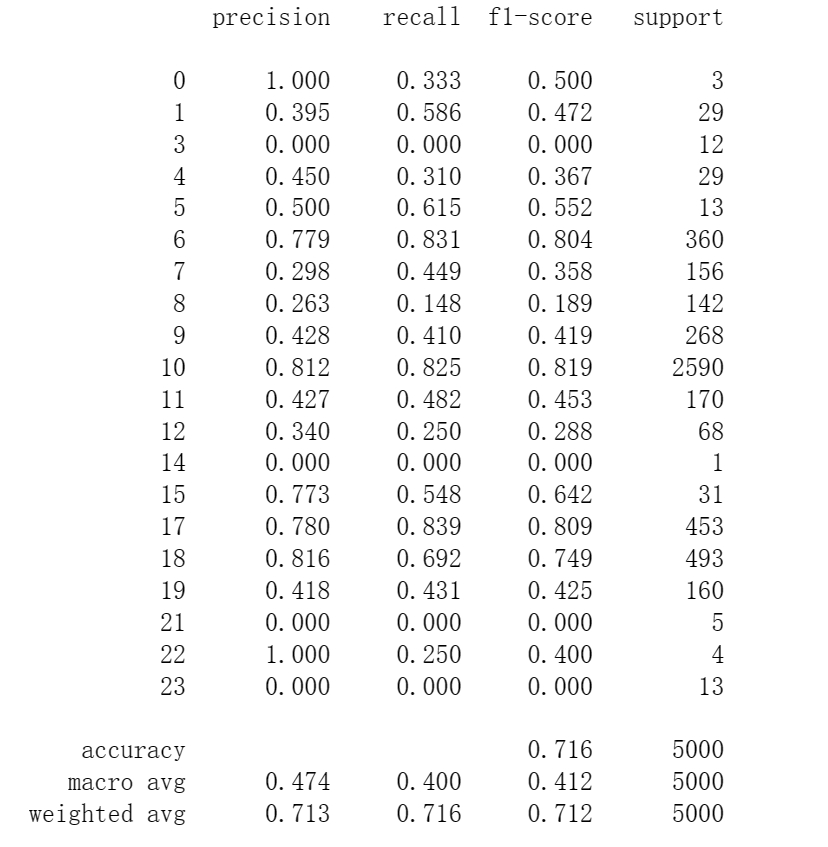
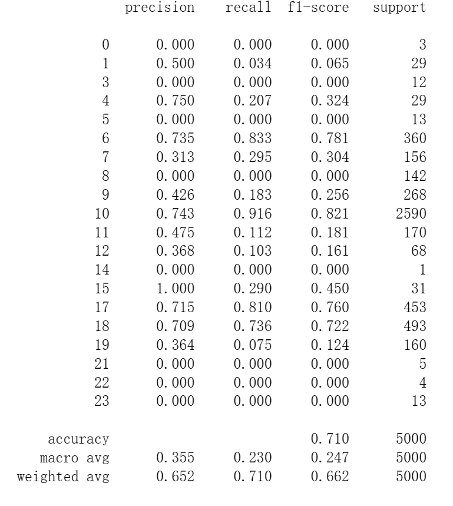
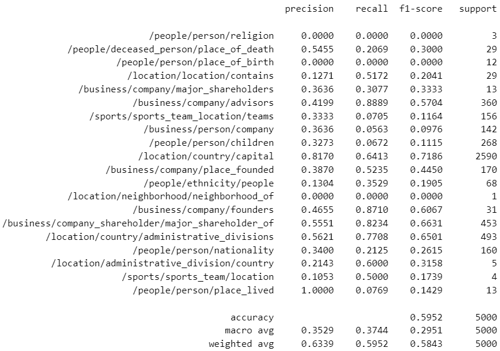
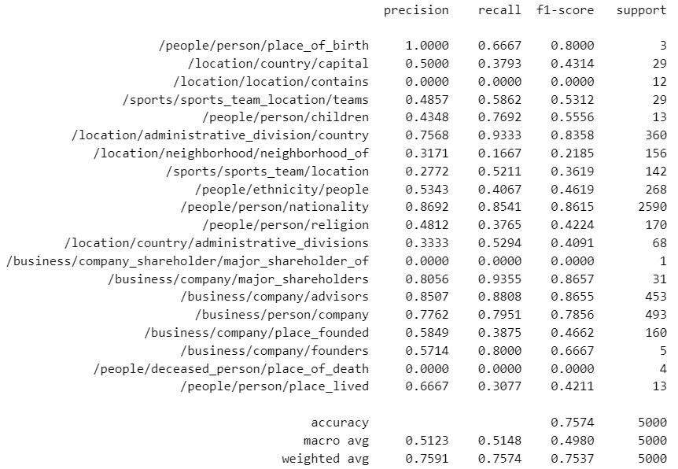

# Relation Extraction (COMP61332 Group Coursework)
  This Project is temporarily used for the group coursework, which contains two functions of Relation extraction.
  1. [BiLSTM](model_code/BILSTM.ipynb), 2. [Bert (pre-trained model: bert-base-cased)](model_code/BERT.ipynb)
# Group Member:
  Junfan Cheng, Tong Shen, Qiujie Xu, Yuxuan Zhang

# Dataset
  The dataset applied in this project is only the "NYT" part of [UniRel Model](https://github.com/wtangdev/UniRel/blob/main/README.md), which data can also be downloaded from [the shared drive link](https://drive.google.com/file/d/1-3uBc_VfaCEWO2_FegzSyBXNeFmqhv7x/view)
  
  The dataset is originally obtained from TPLinker, refer to [TPLinker official repository](https://github.com/131250208/TPlinker-joint-extraction). 

  **Please ensure you download the related dataset file and put them under the correct path**: 
  1. Download and unzip the dataset from [this shared link](https://drive.google.com/file/d/1-3uBc_VfaCEWO2_FegzSyBXNeFmqhv7x/view).
  2. Copy all the files from the **"nyt"** folders within the unzipped folders to the dataset file path: _"./nyt_dataset"_.

# Trained Model file
  The trained model of this assignment has been uploaded in [this link](https://drive.google.com/drive/folders/1o3ftZdWDakhNoVBQofVwe7zYQQVOUOYt?usp=sharing). Please ensure all models are downloaded and put in the _"trained_model"_ folder before running the code.

# How to use this model to predict relations with any input sentences.
  For every model code provided, there exists a section named "Predictor" where users are allowed to modify the input sentence. 

  1. **BiLSTM**: Execute all section cells except for "Model Training and Validation", "Training and Validation Analysis", "Model Testing", and "Drawing the Heatmap of the Confusion Matrix" Subsequently. Users can change the input sentence by changing the _'new_sentence'_ argument of the _'predict_new_sentence'_ method in the last cell of "Predictor".
  2. **Bert**: Firstly, Execute all cells of "Necessary (requirements & data preprocessing)". Then, the cells under the "Predictor" section (1, 2, 3, 4.1.1, 4.1.2) should be run sequentially. The predicted result will be shown as the output of the last cell in section 4.1.2. (user can change input sentences in the cell of section 4.1.1)

  **Tips:**
  1. Before testing or predicting, ensure all model files are downloaded and placed in the directory (./trained_model).
  2. For the predictor of Bert, the 4.2 section does not need to run if you want to test the random input only.

# Adaptations/Improvements
  1. To enhance the [original BiLSTM version](https://medium.com/southpigalle/simple-relation-extraction-with-a-bi-lstm-model-part-1-682b670d5e11), we integrated an additional embedding and attention layer to enhance its capability to focus on relevant labels and avoid concentrating on meaningless ones. The results displayed below demonstrate that this method is a promising approach to improving the performance of BiLSTM.

  2. To improve BERT's performance and deal with the overfitting phenomenon, two additional models are used: one for Named Entity Recognition (NER) from the transformers library and another using [word2vec](https://code.google.com/archive/p/word2vec/). The approach involves expanding the dataset with entities identified by the NER model and selecting the most semantically similar words using cosine distance from the word2vec model. These results are integrated, applying weights based on the effectiveness of the NER and word2vec models, to compute the final score by summing these weighted contributions. Finally, pick the result label with the highest final score.

# Result and Evaluation
  The following picture showcases how different relation extraction models perform, evaluated with the F1 score. This score is great because it checks if a model is not just good at finding correct relationships between words (precision) but also doesn't miss out on many (recall). 
  It's like finding the sweet spot between being accurate and thorough, making it a perfect way to see which model does the best job at understanding texts.

  BiLSTM: The result of BiLSTM with attention (left) and without attention (right) on the test dataset.
  
   

  BERT: The result of Bert with NER & word2vec (left) and without NER & word2vec (right) on the test dataset.
  
   

# Reference
1. Valette, Marion (2019). Simple Relation Extraction with a Bi-LSTM Model. Available online: https://medium.com/southpigalle/simple-relation-extraction-with-a-bi-lstm-model-part-1-682 b670d5e11
2. Tapas Nayak and Hwee Tou Ng. 2019. Effective attention modeling for neural relation extraction. arXiv preprint arXiv:1912.03832
3. Tang, W., Xu, B., Zhao, Y., Mao, Z., Liu, Y., Liao, Y., & Xie, H. (2022). UniRel: Unified Representation and Interaction for Joint Relational Triple Extraction. arXiv preprint arXiv:2211.09039.
